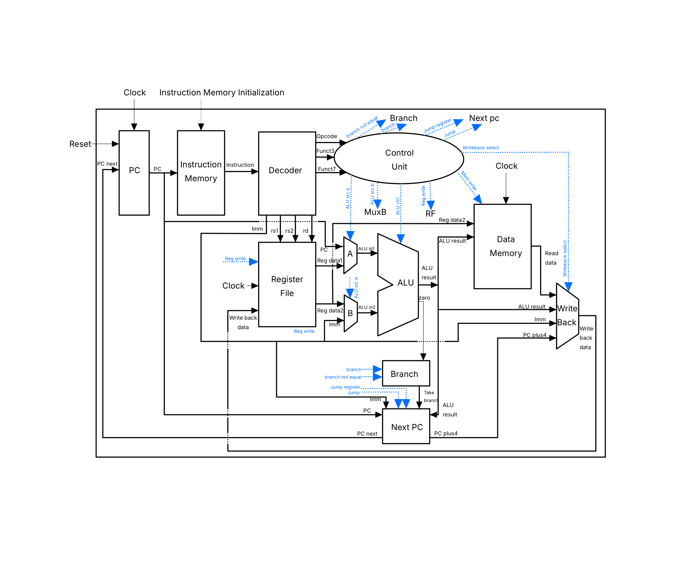

# Single-Cycle RISC-V CPU

## Overview

Custom 32-bit single-cycle RISC-V processor implementing a subset of the RV32I instruction set.

The processor currently supports arithmetic, logical, comparison, immediate, load/store, branch, jump, and upper-immediate instructions. It is built using a modular RTL architecture and verified with automated ModelSim regression tests.

The project also includes a custom Python-based assembler that converts RISC-V assembly programs (`.s` files) into hexadecimal machine code (`.hex` files) that can be loaded directly into the processor's instruction memory.

Together, the processor and custom assembler provide a complete workflow for writing, assembling, and executing RISC-V assembly programs.

## Supported Instructions

Currently supported RV32I instruction subset:

### R-Type Instructions

| Instruction | Description |
|-------------|-------------|
| ADD | Integer addition |
| SUB | Integer subtraction |
| AND | Bitwise AND |
| OR  | Bitwise OR |
| XOR | Bitwise XOR |
| SLT | Set less than |

### I-Type Instructions

| Instruction | Description |
|-------------|-------------|
| ADDI | Add immediate |
| LW | Load word |
| JALR | Jump and link register |

### S-Type Instructions

| Instruction | Description |
|-------------|-------------|
| SW | Store word |

### B-Type Instructions

| Instruction | Description |
|-------------|-------------|
| BEQ | Branch if equal |
| BNE | Branch if not equal |

### U-Type Instructions

| Instruction | Description |
|-------------|-------------|
| LUI | Load upper immediate |
| AUIPC | Add upper immediate to the current PC and store the result |

### J-Type Instructions

| Instruction | Description |
|-------------|-------------|
| JAL | Jump and link |

## Architecture & Datapath

The CPU is implemented as a modular single-cycle datapath. The main datapath and control connections are shown below.



Main RTL components:

- Program Counter (PC)
- Instruction Memory (IMEM)
- Data Memory (DMEM)
- Instruction Decoder
- Control Unit
- Register File
- Arithmetic Logic Unit (ALU)
- 2-to-1 and 4-to-1 Multiplexers (MUX)
- Top-level CPU Integration

## Assembler

The assembler supports:

- Assembly parsing and validation
- ISA-based instruction definitions
- RV32I instruction encoding
- Generation of `.hex` instruction memory files

## Verification

The processor is verified at two levels using SystemVerilog testbenches and ModelSim.

### CPU-Level Verification

The complete CPU is verified through automated regression tests covering:

- Basic datapath
- ALU operations
- Signed operations
- x0 protection
- Store (SW)
- Load (LW)
- Load/store integration
- Branch instructions (BEQ/BNE)
- Jump instructions (JAL/JALR)
- Upper-immediate instructions (LUI/AUIPC)

Each test program is written in RISC-V assembly, assembled into machine code, and executed on the complete processor.

### Module-Level Verification

Individual RTL modules are also tested independently through dedicated SystemVerilog testbenches.

Module-level tests cover:

- ALU
- Branch Unit
- Control Unit
- Decoder
- Data Memory
- Instruction Memory
- Multiplexers
- Next PC Logic
- Program Counter
- Register File

The module-level regression compiles the RTL and testbenches, then runs each module testbench sequentially.

## Simulation

Run the complete CPU regression:

```bash
vsim -do sim/regression.do
```

Run the module-level regression:

```bash
vsim -do sim/module_simulation.do
```

## Project Structure

| Directory | Description |
|----------|-------------|
| `rtl/` | SystemVerilog RTL modules |
| `tb/` | SystemVerilog testbenches |
| `assembler/` | Custom Python RV32I assembler |
| `programs/` | Assembly programs and generated `.hex` files |
| `sim/` | ModelSim compilation and regression scripts |

## Tool Flow

```text
Assembly (.s)
        │
        ▼
Custom Python Assembler
        │
        ▼
Machine Code (.hex)
        │
        ▼
Instruction Memory
        │
        ▼
Single-Cycle RV32I CPU
        │
        ▼
ModelSim Simulation & Regression Tests
```